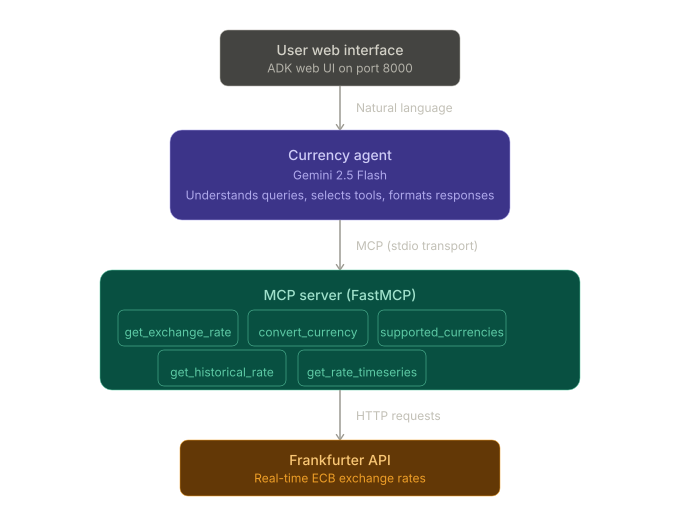

# 💱 CurrencyBot — MCP-Powered Currency Exchange Agent

> A smart currency exchange assistant powered by Google ADK, Gemini 2.5 Flash, and real-time exchange rates via MCP (Model Context Protocol).

**Live Demo:** [https://currency-agent-381066349460.us-central1.run.app/](https://currency-agent-381066349460.us-central1.run.app/)

---

## What is CurrencyBot?

CurrencyBot is an AI-powered currency exchange assistant that fetches **real-time exchange rates** from the Frankfurter API and answers natural language queries about currencies. It's built using Google's Agent Development Kit (ADK) with Gemini 2.5 Flash as the underlying model, and exposes its data tools via the **Model Context Protocol (MCP)**.

Ask it anything:
- *"What's 1 USD in INR right now?"*
- *"Convert 5000 Japanese Yen to Euros"*
- *"What was the USD to GBP rate on January 15, 2024?"*
- *"Show me the EUR to INR trend over the last 3 months"*
- *"What currencies are supported?"*

Every answer is backed by real data — CurrencyBot never guesses exchange rates.

---

## 🏗️ Architecture



---

## 🔧 MCP Tools

CurrencyBot exposes 5 tools via the Model Context Protocol:

| Tool | Description | Example Input |
|---|---|---|
| `get_exchange_rate` | Get the current rate between two currencies | `base: "USD", target: "INR"` |
| `convert_currency` | Convert a specific amount using live rates | `amount: 100, base: "EUR", target: "JPY"` |
| `get_supported_currencies` | List all supported currency codes and names | (no args) |
| `get_historical_rate` | Get the rate for a specific past date | `date: "2024-01-15", base: "USD", target: "GBP"` |
| `get_rate_timeseries` | Get rate history over a date range with trend analysis | `base: "EUR", target: "INR", start: "2024-01-01", end: "2024-06-30"` |

All tools return structured JSON with status, data, and human-readable descriptions. The timeseries tool additionally returns highest, lowest, and average rates over the period.

---

## 🛠️ Tech Stack

- **Google ADK** (`google-adk==1.14.0`) — Agent Development Kit for building AI agents with tool use
- **Gemini 2.5 Flash** — Google's fast, capable model with reliable function calling
- **MCP** (`mcp>=1.8.0`) — Model Context Protocol for exposing tools to the agent
- **FastMCP** — MCP server framework for Python (stdio transport)
- **Frankfurter API** — Free, open-source exchange rate API powered by European Central Bank data
- **Google Cloud Run** — Serverless deployment with auto-scaling
- **Docker** — Containerized for consistent deployment

---

## 🚀 Run Locally

### Prerequisites
- Python 3.11+
- A Gemini API key from [Google AI Studio](https://aistudio.google.com/apikey)

### Setup

```bash
# Clone the repo
git clone https://github.com/VishwasPrabhakara/currency-bot.git
cd currency-bot

# Install dependencies
pip install -r requirements.txt

# Create your .env file
cp .env.example .env
# Edit .env and add your real Gemini API key

# Run the agent
adk web --port 8000 --host 0.0.0.0 .
```

Open **http://localhost:8000** in your browser. Start asking about currencies!

### Example Queries to Try

```
What is 1 USD in INR?
Convert 250 EUR to Japanese Yen
What was the dollar to pound rate on March 1, 2024?
Show me the USD to EUR trend from January to June 2024
What currencies are supported?
```

---

## 🐳 Deploy to Cloud Run

```bash
# Set your project
gcloud config set project YOUR_PROJECT_ID

# Deploy from source
gcloud run deploy currency-agent \
  --source . \
  --region us-central1 \
  --allow-unauthenticated \
  --set-env-vars GOOGLE_API_KEY=your_key_here,GOOGLE_GENAI_USE_VERTEXAI=FALSE \
  --memory 512Mi \
  --timeout 300
```

The agent will be live at the URL printed after deployment.

---

## 📁 Project Structure

```
currency-bot/
├── .env.example          # Template for environment variables
├── .gitignore            # Excludes .env, __pycache__, etc.
├── Dockerfile            # Container config for Cloud Run
├── requirements.txt      # Python dependencies (google-adk, mcp)
├── architecture.svg      # Architecture diagram
├── README.md             # This file
└── currency_agent/
    ├── __init__.py       # Exports root_agent for ADK discovery
    ├── agent.py          # Agent definition (Gemini 2.5 Flash + MCP toolset)
    └── mcp_server.py     # MCP server with 5 currency tools (Frankfurter API)
```

---

## 🔑 Environment Variables

| Variable | Description | Required |
|---|---|---|
| `GOOGLE_API_KEY` | Your Gemini API key from Google AI Studio | Yes |
| `GOOGLE_GENAI_USE_VERTEXAI` | Set to `FALSE` for API key auth (vs Vertex AI) | Yes |

---

## 💡 How It Works

1. **User sends a natural language query** via the ADK web interface
2. **Gemini 2.5 Flash** interprets the query and selects the appropriate MCP tool
3. **The MCP server** receives the tool call via stdio transport and hits the Frankfurter API
4. **Real exchange rate data** is returned as structured JSON
5. **Gemini formats the response** into a clear, human-readable answer with the rate, date, and context

The agent never guesses rates — every number comes from a real API call to the European Central Bank's published rates via Frankfurter.

---

## 🌍 Supported Currencies

CurrencyBot supports 30+ currencies via the Frankfurter API, including:

AUD, BGN, BRL, CAD, CHF, CNY, CZK, DKK, EUR, GBP, HKD, HRK, HUF, IDR, ILS, INR, ISK, JPY, KRW, MXN, MYR, NOK, NZD, PHP, PLN, RON, SEK, SGD, THB, TRY, USD, ZAR

For the full list with names, ask the bot: *"What currencies are supported?"*

---

## 📝 Built For

Google Cloud Gen AI Academy APAC Edition — Track 1 Submission

**Built by:** Vishwas Prabhakara

---

## 📄 License

MIT
